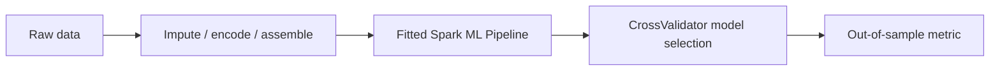

# Distributed Machine Learning with PySpark

This repository contains four portable Spark ML pipelines covering binary and multiclass classification, regression, feature engineering, evaluation, and cross-validated model selection. Each workflow runs as a standalone `spark-submit` job with explicit inputs and out-of-sample evaluation.

## Approach

| Project | Analytics task | Pipeline |
|---|---|---|
| Titanic survival | Binary classification | Missing-value handling, categorical encoding, Random Forest, AUC evaluation |
| Bike-share demand | Regression | Leakage-safe feature selection, vector indexing, Gradient-Boosted Trees, RMSE tuning |
| Used-car acceptability | Multiclass classification | String indexing, vector assembly, Decision Tree, accuracy evaluation |
| Concrete strength | Regression | Age bucketing, scaling, Random Forest regression, RMSE evaluation |

## Pipeline design



Spark ML pipelines keep data preparation and modelling stages inside the same fitted workflow, reducing the risk of inconsistent transformations between training and scoring. The four implementations apply that pattern across different target types and evaluation metrics.

## Run

```bash
python -m venv .venv
source .venv/bin/activate
pip install -r requirements.txt

spark-submit src/titanic_classifier.py --input data/titanic.csv
spark-submit src/bikeshare_regression.py --input data/hour.csv
spark-submit src/used_car_classifier.py --train data/cars_train.csv --test data/cars_test.csv
spark-submit src/concrete_regression.py --train data/concrete_train.csv --test data/concrete_test.csv
```

Every command prints an out-of-sample metric and the selected model configuration. Large/public datasets are not duplicated in the repository.

## Skills represented

`PySpark` · `Spark MLlib` · `Pipeline` · `StringIndexer` · `OneHotEncoder` · `Imputer` · `VectorAssembler` · `CrossValidator` · `Random Forest` · `Gradient-Boosted Trees`
